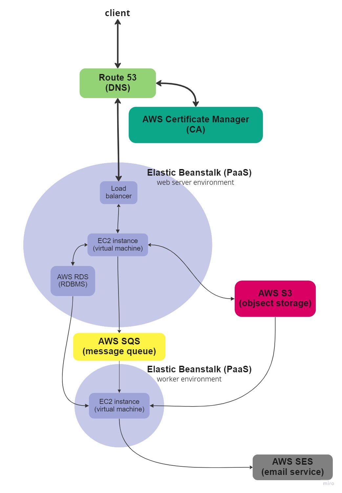

# FreeCardBoard
## Introduction
FreeCardBoard is a social networking website that allows users to create accounts, establish boards, post cards, and invite friends to leave messages on their boards.
## Features
1. Client-side
> - Built with React.js and react-router-dom
2. Server-side
> - Developped with Node.js/express.js
> - Utilizing worker application
3. Amazon Web Service (AWS)
> - MySQL (**RDS**) for database storage
> - **S3** for efficient image storage
> - **Elastic beanstalk** for web and worker application deployment 
> - **Route 53** for domain name management
> - **Certificate manager** for SSL/TLS certificates
> - **SQS** for message queueing
> - **SES** for reliable email sending service
4. Authentication
> - Implementing cookie-session for user authentication
5. **Google API**
> - Integrated OAuth2 using Google API
6. Continuous Integration and Deployment (CICD)
> - Utilizing **Github Actions** for streamlined CICD processes
## System Design

The provided system design diagram illustrates the overall architecture and flow of FreeBoardCard
